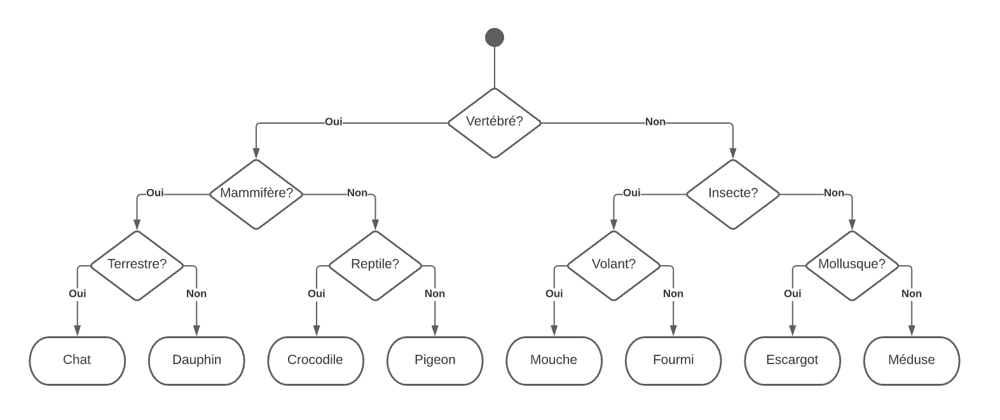
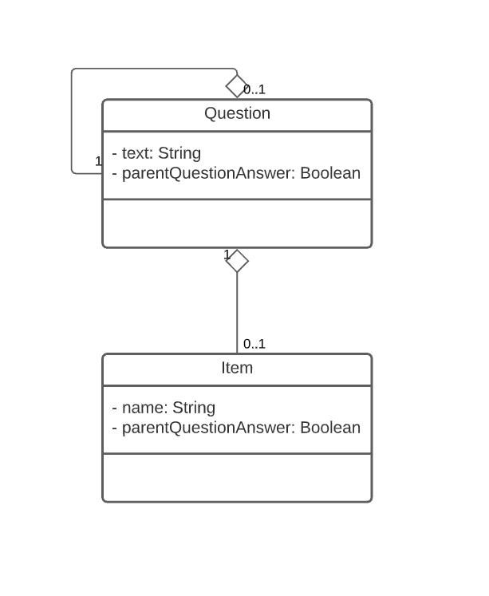

# Travaux pratiques - Java / JDBC

L'objectif du jour est de réaliser une implémentation du [jeu des 20 questions](https://psycatgames.com/fr/magazine/conversation-starters/20-questions-game/).

Ca ne vous dit rien?

Peut-être si je vous dis [Akinator](https://fr.akinator.com/)?

Ca y est?

Bon alors, pas de panique, on va en faire une version **très** simplifiée. Mais ça ne veut pas dire que les gens ne seront pas étonnés! N'oubliez pas que la magie se passe dans l'oeil du spectateur (ou dans notre cas, de l'utilisateur)!

## Principe de fonctionnement

Nous allons réaliser un algorithme qui fonctionne avec un [arbre binaire](https://fr.wikipedia.org/wiki/Arbre_binaire) de questions. C'est une façon galvaudée de dire, simplement, qu'à chaque question posée, la réponse de l'utilisateur (**oui** ou **non**) permet d'exclure la moitié des possibilités restantes, jusqu'à ce qu'il n'y en ait plus qu'une (voir le diagramme ci-dessous).

L'algorithme suit donc tranquillement le chemin indiqué par l'utilisateur à chaque noeud de décision, et propose une réponse dès qu'il ne trouve plus de question à poser.



## Modèle de données

### Modèle conceptuel de données



### Dictionnaire de données

#### Question

_Représente une question à laquelle l'utilisateur peut répondre par **oui** ou par **non**._

| Propriété | Type | Commentaire | Exemple |
| --- | --- | --- | --- |
| `text` | String | Texte de la question, telle que posée à l'utilisateur. | "Votre animal a-t-il quatre pattes?" |
| `parent_question_id` | Integer | ID de la question "parente", qui mène à cette question lorsqu'on suit l'arbre. Cet ID peut être NULL uniquement pour la première question, au sommet de l'arbre | |
| `parent_question_answer` | Boolean | Réponse donnée à la question parente (**oui** ou **non**) menant à cette question. | |

> **Note:** il n'est pas possible d'avoir deux questions ayant la même question parente **ET** la même réponse à la question parente. Ainsi, une question peut être associée à _"Votre animal a-t-il quatre pattes?"_ et **oui**, une autre question peut être associée à _"Votre animal a-t-il quatre pattes?"_ et **non**, mais cela fait, plus aucune question ne peut être associée à _"Votre animal a-t-il quatre pattes?"_.

#### Item

_Représente une proposition que l'algorithme peut soumettre à l'utilisateur dès qu'il a épuisé ses questions._

| Propriété | Type | Commentaire | Exemple |
| --- | --- | --- | --- |
| `name` | String | Nom de l'objet, tel que présenté à l'utilisateur. | "Poule" |
| `parent_question_id` | Integer | ID de la question "parente", qui mène à cet élément lorsqu'on suit l'arbre. Cet ID peut techniquement être NULL, mais n'est pas censé l'être, c'est-à-dire qu'en cas de suppression de la question parente, on devrait pouvoir réassocier l'élément à une nouvelle question, ou bien le supprimer. | |
| `parent_question_answer` | Boolean | Réponse donnée à la question parente (**oui** ou **non**) menant à cet élément. | |

> **Note:** tout comme les **questions**, il n'est pas possible d'avoir deux éléments ayant la même question parente **ET** la même réponse à la question parente.

## C'est parti!

### Installation

- Cloner ce dépôt.
- Utiliser Maven pour ajouter le pilote JDBC correspondant à votre moteur de base de données.
- Installer les dépendances avec Maven.
- Importer le fichier **java_twenty_questions.sql** dans votre moteur de base de données.

### 1. Créer une connexion à la base de données

Etablir une connexion à la base de données, et la tester avec une requête simple, pour afficher toutes les questions dans la console.

### 2. Afficher la première question

Ecrire la requête SQL permettant de récupérer la première question en base de données, et l'afficher dans la console.

<details>
  <summary>[SOLUTION] Requête SQL</summary>

```
SELECT * FROM `questions` WHERE `parent_question_id` IS NULL
```
</details>

### 3. Demander une réponse à l'utilisateur

Demander à l'utilisateur de répondre par oui (O) ou par non (N) à la queston posée. Seulement les réponses prévues (O/N) doivent être acceptés, si l'utilisateur rentre autre chose, il doit recevoir un message d'avertissement, et rien ne doit se passer.

### 4. Afficher la question suivante

En fonction de la réponse donnée par l'utilisateur à la question actuelle, récupérer la question suivante selon le cheminement de l'arbre. Recommencer alors le cycle (poser une question, demander une réponse à l'utilisateur, chercher la question suivante), et terminer l'application dès qu'il ne reste aucune question à poser.

<details>
  <summary>[SOLUTION] Requête SQL</summary>

Avec:

- **currentQuestionId**: ID de la question à laquelle l'utilisateur vient de répondre
- **userAnswer**: Réponse donnée par l'utilisateur sous forme de nombre (0 = non, 1 = oui)

```
SELECT * FROM `questions` WHERE `parent_question_id` = [currentQuestionId] AND `parent_question_answer` = [userAnswer]
```
</details>

### 5. Proposer une solution

A chaque fois que l'utilisateur répond à une question, et avant de charger la question suivante, chercher s'il existe une solution associée à la question à laquelle l'utilisateur vient de répondre. Si oui, alors l'application doit proposer la solution à l'utilisateur. Si l'utilisateur valide la réponse, l'application se termine, sinon elle continue normalement.

> **Note:** dans l'état de la base de données proposée, il se trouve que toutes les solutions correspondent à une fin de l'arbre (cest-à-dire qu'il n'y a plus de question qui suit), mais l'application doit pouvoir proposer une solution même s'il reste des questions après.

### 6. Apprendre une nouvelle solution à l'application

Si l'application se termine sans avoir trouvé la solution de l'utilisateur, alors elle doit demander à l'utilisateur:

- quelle était sa solution,
- quelle question lui permettrait de faire la différence entre la solution de l'utilisateur et la solution proposée par l'application,
- et quelle réponse mènerait à chacune des solutions.

> **Exemple:** si l'application a proposé "crocodile" alors que l'utilisateur avait pensé à "dinosaure", l'application doit demander "écrivez une question qui me permettrait de distinguer un crocodile d'un dinosaure". L'utilisateur pourrait alors proposer: "Votre animal existe-t-il toujours?". Ensuite, l'application doit demander "entre crocodile et dinosaure, quelle proposition correspond à la réponse OUI quand on pose la question: Votre animal existe-t-il toujours?". L'utilisateur répondrait alors: crocodile.

La nouvelle solution proposée par l'utilisateur doit être inscrite dans la base de données, avec le numéro de question parente, et la réponse à la question parente adéquats.

> **Note:** il ne faut pas oublier de modifier le numéro de question parente, ainsi que la réponse à la question parente de la proposition rejetée par l'utilisateur! (dans l'exemple précédent, il faut inscrire "dinosaure" dans la base de donneés, mais il faut aussi changer "crocodile" de place)
